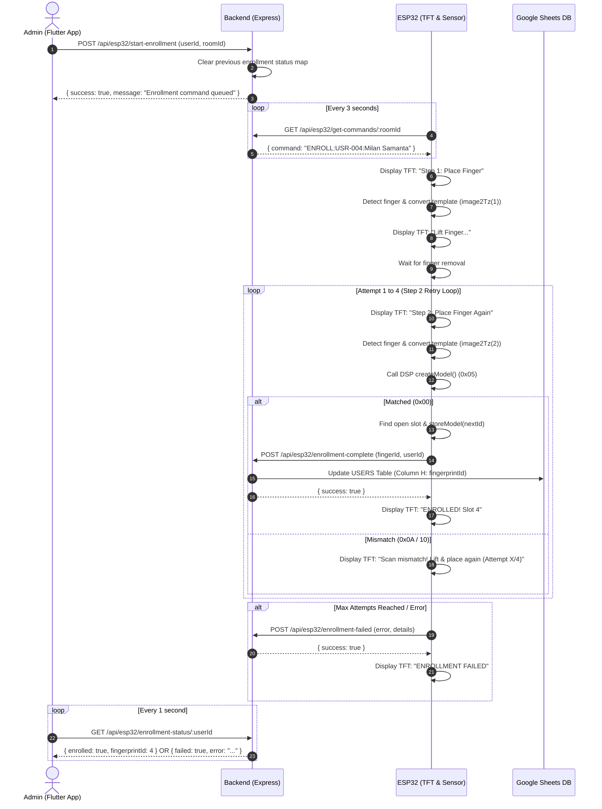
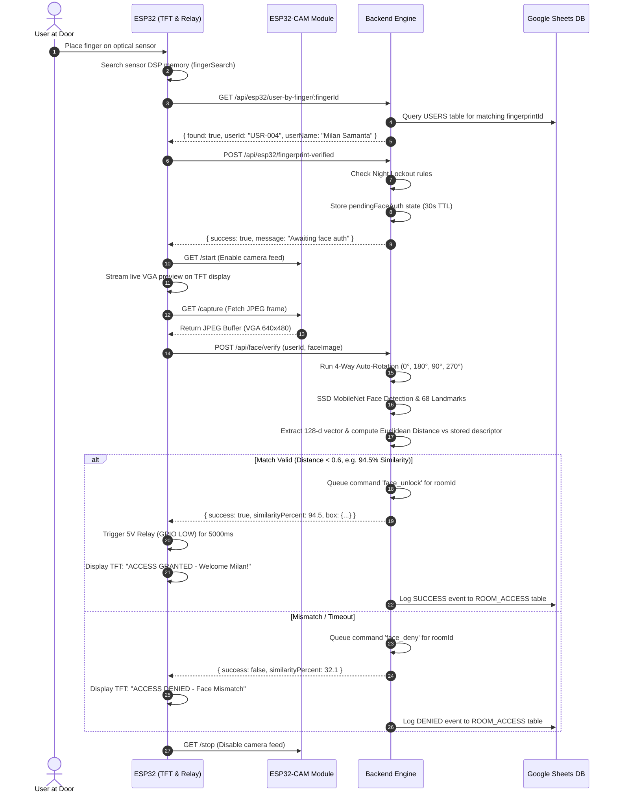

# 🔄 LabSync - Complete System Workflows & Integration Guide

This guide details all end-to-end execution flows, state machine transitions, sequence diagrams, and error handling mechanisms in **LabSync**.

---

## 📋 Table of Contents
1. [Biometric Fingerprint Enrollment Sequence](#1-biometric-fingerprint-enrollment-sequence)
2. [Dual-Biometric Authentication Sequence](#2-dual-biometric-authentication-sequence)
3. [Auto-Rotation & Face Recognition Pipeline](#3-auto-rotation--face-recognition-pipeline)
4. [Hardware & Network Fault Tolerance](#4-hardware--network-fault-tolerance)
5. [Error Code Dictionary & Recovery Steps](#5-error-code-dictionary--recovery-steps)

---

## 1. Biometric Fingerprint Enrollment Sequence

This workflow registers a user's fingerprint on the Adafruit optical sensor via admin command from the Flutter App.

### Sequence Flow Diagram



---

## 2. Dual-Biometric Authentication Sequence

Dual-biometric authentication requires a valid fingerprint match followed immediately by facial verification.



---

## 3. Auto-Rotation & Face Recognition Pipeline

Incoming camera frames from ESP32-CAM or Mobile/Web clients are processed through our multi-stage biometric pipeline in `backend/services/faceService.js`:

```
┌─────────────────────────────┐
│  Incoming JPEG Image Buffer │
└──────────────┬──────────────┘
               │
               ▼
┌─────────────────────────────┐      0° / 180° / 90° / 270°
│  Canvas Transformation      │ ─────────────────────────────────┐
│  Multi-Angle Rotation       │                                  │
└──────────────┬──────────────┘                                  │
               │                                                 │
               ▼                                                 ▼
┌─────────────────────────────┐                     ┌─────────────────────────────┐
│ SSD MobileNet v1            │                     │ Face Landmark 68            │
│ Neural Face Detector        │ ──────────────────> │ Feature Extraction          │
└─────────────────────────────┘                     └────────────┬────────────────┘
                                                                 │
                                                                 ▼
┌─────────────────────────────┐                     ┌─────────────────────────────┐
│  Euclidean Distance Math    │                     │ Face Recognition Net        │
│  d = sqrt( sum( (a-b)^2 ) ) │ <────────────────── │ 128-d Feature Vector        │
└──────────────┬──────────────┘                     └─────────────────────────────┘
               │
               ▼
┌─────────────────────────────┐
│  Match Evaluation           │  If Distance < 0.6  --> MATCH SUCCESS
│  Similarity % Calculation   │  If Distance >= 0.6 --> MATCH FAILED
└─────────────────────────────┘
```

---

## 4. Hardware & Network Fault Tolerance

### 1. In-Memory Command & Status Queues (`sharedState.js`)
To eliminate Google Sheets API rate-limit quota exhaustion during frequent 3-second hardware polling, all active commands, pending face states, and device heartbeats operate strictly in-memory:
- `pendingCommands`: Map of `roomId` $\rightarrow$ active commands (`enroll`, `face_unlock`, `face_deny`).
- `enrollmentStatus`: Map of `userId` $\rightarrow$ active enrollment progress/completion.
- `pendingFaceAuth`: Map of `roomId` $\rightarrow$ dual auth state with 30-second TTL expiration.

### 2. Network Resilience & Auto-Discovery
- **mDNS Auto-Discovery**: ESP32 client resolves `esp32cam.local` dynamically over mDNS.
- **Hardcoded IP Fallback**: If mDNS fails due to router isolation, the firmware automatically falls back to static IP (`http://192.168.154.133`).
- **HTTP Timeout Margin**: Client HTTP request timeouts are set to **45 seconds** to accommodate network jitter.

---

## 5. Error Code Dictionary & Recovery Steps

### Adafruit Fingerprint Sensor DSP Codes (Hex / Decimal)

| Code | Name | Meaning | Root Cause & Resolution |
| :--- | :--- | :--- | :--- |
| `0x00` (0) | `FINGERPRINT_OK` | Command succeeded | Normal operation. |
| `0x01` (1) | `FINGERPRINT_PACKETRECIEVEERR` | Communication error | Check TX/RX wiring between ESP32 and sensor. |
| `0x02` (2) | `FINGERPRINT_NOFINGER` | No finger on sensor | User lifted finger or touched too lightly. |
| `0x06` (6) | `FINGERPRINT_IMAGEFAIL` | Image capture failed | Dirty sensor glass or low illumination. |
| `0x07` (7) | `FINGERPRINT_IMAGEMESS` | Blurry image | User moved finger during conversion. |
| `0x0A` (10)| `FINGERPRINT_ENROLLMISMATCH` | Scans did not match | User shifted finger position significantly between Step 1 and Step 2. Firmware automatically triggers Step 2 retry loop (up to 4 attempts). |
| `0x0B` (11)| `FINGERPRINT_BADLOCATION` | Invalid storage ID | Slot index is outside 1 to 1000 range. |
| `0x22` (34)| `FINGERPRINT_FLASHERR` | Flash writing failed | Hardware flash sensor error. Reset sensor power. |

### Network & Library Error Codes

| Code | Component | Cause | Resolution |
| :--- | :--- | :--- | :--- |
| `-11` | ESP32 HTTPClient | `HTTPC_ERROR_READ_TIMEOUT` | Raised when backend takes > 25s to respond. Fixed by pre-downloading neural models to `backend/models` for instant disk load. |
| `-1` | ESP32 HTTPClient | `HTTPC_ERROR_CONNECTION_REFUSED` | Server offline or wrong IP address configured in `SERVER_URL`. |
| `400` | Node Backend | Missing required body parameters | Verify JSON payload fields (`userId`, `roomId`, `faceImage`). |
| `401` | Node Backend | Face mismatch or unauthorized | User face similarity < 60%. Retake enrollment or improve lighting. |
