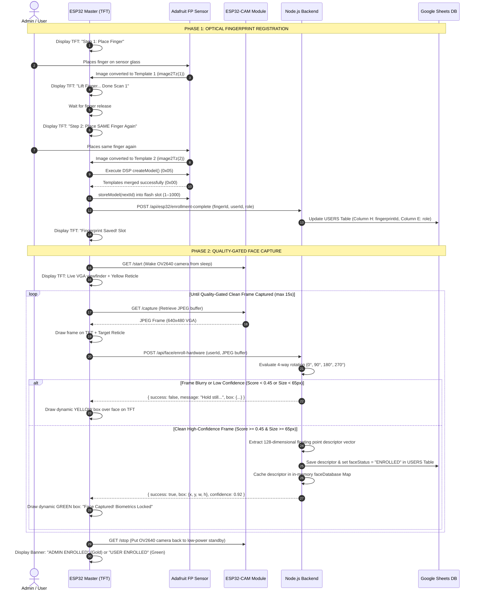
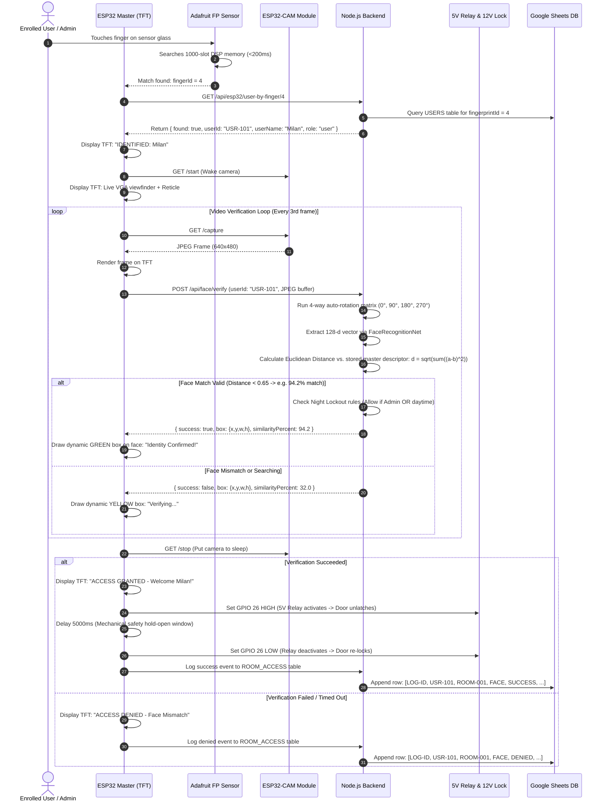

# 🏛️ LabSync - End-to-End System Workflow & Hardware-to-Cloud Guide

> **Author**: Milan Samanta & LabSync Engineering Team  
> **Affiliation**: Indian Institute of Technology Kharagpur (IIT KGP) Internship Project  
> **System**: IoT Dual-Biometric Laboratory Access Control & Resource Management  
> **Target Audience**: Evaluators, Professors, Hardware Engineers, Software Developers, and Lab Administrators  

---

## 📋 Table of Contents
1. [System Overview & Architecture Diagram](#1-system-overview--architecture-diagram)
2. [Hardware Component Inventory & Electrical Wiring](#2-hardware-component-inventory--electrical-wiring)
3. [Network Topology & Single-Subnet Communication](#3-network-topology--single-subnet-communication)
4. [Core Philosophy: ENROLL vs. VERIFY](#4-core-philosophy-enroll-vs-verify)
5. [Workflow 1: Biometric Enrollment (New User / Admin)](#5-workflow-1-biometric-enrollment-new-user--admin)
6. [Workflow 2: Biometric Verification & Door Relay (Existing User / Admin)](#6-workflow-2-biometric-verification--door-relay-existing-user--admin)
7. [User vs. Admin Privilege & Hardware Trigger Matrix](#7-user-vs-admin-privilege--hardware-trigger-matrix)
8. [Database Schema & Cloud Persistence (Google Sheets API)](#8-database-schema--cloud-persistence-google-sheets-api)
9. [Flutter Frontend Role & Telemetry Dashboard](#9-flutter-frontend-role--telemetry-dashboard)
10. [IIT Evaluation & Viva Technical Defense Cheat Sheet](#10-iit-evaluation--viva-technical-defense-cheat-sheet)

---

## 1. System Overview & Architecture Diagram

**LabSync** is a dual-biometric access control system integrating physical embedded hardware with cloud-based AI facial recognition and a multi-platform administrative dashboard.

All biometric captures (both **fingerprint** and **face**) are conducted **strictly on physical hardware** (ESP32 DevKit + Adafruit DSP Sensor + ESP32-CAM) to prevent remote photo spoofing. The Flutter web/mobile application serves as an administrative control panel, audit viewer, and telemetry dashboard.

```
┌───────────────────────────────────────────────────────────────────────────────────────────┐
│                                   LABSYNC ARCHITECTURE                                    │
└───────────────────────────────────────────────────────────────────────────────────────────┘

  ┌───────────────────────────┐           HTTP REST             ┌───────────────────────────┐
  │    FLUTTER FRONTEND       │ ◄─────────────────────────────► │   NODE.JS EXPRESS API     │
  │ (Admin & Researcher UI)   │     JWT Authenticated / JSON    │ (FaceNet / Sheets Engine) │
  └───────────────────────────┘                                 └─────────────┬─────────────┘
                                                                              │
                                                                              │ Google Sheets API
                                                                              ▼
                                                                ┌───────────────────────────┐
                                                                │  GOOGLE SHEETS DATABASE   │
                                                                │  (USERS & ACCESS LOGS)    │
                                                                └───────────────────────────┘
                                                                              ▲
                                                                              │ HTTP Polling &
                                                                              │ Multipart Streaming
                                                                              ▼
                                  ┌─────────────────────────────────────────────────────────┐
                                  │                  PHYSICAL DOOR TERMINAL                 │
                                  │                                                         │
                                  │  ┌──────────────────────┐     HTTP      ┌────────────┐  │
                                  │  │   ESP32-CAM SERVER   │ ────────────► │   ILI9341  │  │
                                  │  │ (OV2640 VGA Stream)  │               │ 2.8" TFT   │  │
                                  │  └──────────┬───────────┘               └────────────┘  │
                                  │             │                                           │
                                  │             ▼                                           │
                                  │  ┌──────────────────────┐     UART      ┌────────────┐  │
                                  │  │   ESP32 MASTER MCU   │ ◄───────────► │  ADAFRUIT  │  │
                                  │  │     (WROOM-32)       │               │ OPTICAL FP │  │
                                  │  └──────────┬───────────┘               └────────────┘  │
                                  │             │                                           │
                                  │             ▼ GPIO 26 (Active HIGH Pulse)               │
                                  │  ┌──────────────────────┐               ┌────────────┐  │
                                  │  │   5V RELAY MODULE    │ ────────────► │ 12V LOCK / │  │
                                  │  │  (Optocoupler Driver)│               │  SOLENOID  │  │
                                  │  └──────────────────────┘               └────────────┘  │
                                  └─────────────────────────────────────────────────────────┘
```

---

## 2. Hardware Component Inventory & Electrical Wiring

### Complete Component Manifest

| Item | Component | Specification | Function |
| :---: | :--- | :--- | :--- |
| **1** | **Master Controller** | ESP32 DevKit V1 (30-pin, ESP-WROOM-32) | Coordinates TFT, fingerprint UART, relay triggers, and backend networking |
| **2** | **Camera Server** | AI-Thinker ESP32-CAM (OV2640 + 4MB PSRAM) | Streams VGA (640x480) JPEG frames to ESP32 on demand |
| **3** | **Color Display** | 2.8" SPI TFT LCD (ILI9341, 320x240) | Live video viewfinder, reticle, dynamic bounding boxes, and system prompts |
| **4** | **Optical Biometrics** | Adafruit Optical Fingerprint Sensor (AS608 / FPM10A) | Hardware DSP matching, feature extraction, on-chip flash memory (1000 slots) |
| **5** | **Switching Actuator** | 5V 1-Channel Relay Module (Optocoupler Isolated) | Controls high-power 12V DC electromagnetic door lock or solenoid latch |
| **6** | **Power Supply** | 5V 2.5A Regulated DC Power Rail | Common VCC and Ground for both ESP32 units, sensor, and relay |

---

### Pinout & Wiring Interconnect Matrix

```
  ESP32 MASTER (WROOM-32)                  PERIPHERAL MODULES
  ┌───────────────────────┐
  │                GPIO 15│ ───────────────► TFT_CS       (ILI9341 SPI)
  │                GPIO 02│ ───────────────► TFT_DC       (Data/Command)
  │                GPIO 04│ ───────────────► TFT_RST      (Reset)
  │                GPIO 23│ ───────────────► TFT_MOSI     (SPI Data Out)
  │                GPIO 18│ ───────────────► TFT_SCK      (SPI Clock)
  │                GPIO 19│ ◄─────────────── TFT_MISO     (SPI Data In)
  │                       │
  │                GPIO 16│ ◄─────────────── SENSOR_TX    (Adafruit FP UART2 RX)
  │                GPIO 17│ ───────────────► SENSOR_RX    (Adafruit FP UART2 TX)
  │                       │
  │                GPIO 26│ ───────────────► RELAY_IN     (5V Relay Signal)
  │                       │
  │                     5V│ ───────────────► VCC          (Common 5V Rail)
  │                    GND│ ───────────────► GND          (Common Ground Rail)
  └───────────────────────┘

  ESP32-CAM (AI-THINKER)                   POWER & NETWORK
  ┌───────────────────────┐
  │                     5V│ ───────────────► 5V Rail
  │                    GND│ ───────────────► Common Ground Rail
  │             WiFi Radio│ ◄- - - - - - - ► Communicates over Local Subnet
  └───────────────────────┘
```

---

## 3. Network Topology & Single-Subnet Communication

All modules operate seamlessly within a **Single Local Subnet** (e.g. `192.168.137.x` via Laptop Mobile Hotspot or Lab Router):

```
                                  [ LOCAL SUBNET: 192.168.137.0/24 ]
                                                  │
                 ┌────────────────────────────────┼────────────────────────────────┐
                 ▼                                ▼                                ▼
    ┌──────────────────────────┐    ┌──────────────────────────┐    ┌──────────────────────────┐
    │     DEVELOPMENT HOST     │    │      ESP32 MASTER        │    │        ESP32-CAM         │
    │  IP: 192.168.137.1:5000  │    │     IP: 192.168.137.106  │    │     IP: 192.168.137.105  │
    │                          │    │                          │    │                          │
    │  - Node.js Express API   │    │  - Connects to Wi-Fi     │    │  - Connects to Wi-Fi     │
    │  - SSD MobileNet v1      │ ◄──┤  - Polls commands every 3s│ ◄──┤  - Serves /capture       │
    │  - Google Sheets Client  │    │  - Drives TFT & Relay    │    │  - Low-power idle sleep  │
    └──────────────────────────┘    └──────────────────────────┘    └──────────────────────────┘
```

- **ESP32-CAM Discovery**: The master ESP32 locates the camera via `esp32cam.local` (mDNS) with an automatic fallback to `CAMERA_IP_FALLBACK` (e.g. `192.168.137.105`) if router isolation disables mDNS multicast.
- **Direct Video Stream**: When activated, the master ESP32 requests raw JPEG frames directly from `http://192.168.137.105/capture`, decodes them on-the-fly via `TJpg_Decoder`, and renders them on the ILI9341 TFT display at ~8–12 frames per second.

---

## 4. Core Philosophy: ENROLL vs. VERIFY

Understanding the strict boundary between **Enrollment** and **Verification** is fundamental:

| Concept | Purpose | Who Uses It? | Frequency | Hardware Behavior |
| :--- | :--- | :--- | :--- | :--- |
| **ENROLLMENT** | First-time registration of identity & biometrics | **New Users** or **New Admins** | Once per person | Extracts 2 fingerprint templates + stores in DSP flash slot `nextId`; captures high-quality face, extracts 128-d descriptor, writes to Google Sheets `USERS`. |
| **VERIFICATION** | Physical door unlock & entry authentication | **Existing Enrolled Users & Admins** | Every visit to the lab | Fingerprint matched in DSP (<200ms); live camera frame matched via Euclidean distance ($d < 0.65$); triggers 5V relay for 5 seconds; logs entry to `ROOM_ACCESS`. |

---

## 5. Workflow 1: Biometric Enrollment (New User / Admin)

Enrollment can be triggered in two ways:
1. **Remote Dispatch from Flutter App**: Admin enters user details (Name, Email, Role, Department, Rooms) and taps **"Enroll on ESP32 Terminal"**.
2. **Autonomous Terminal Menu**: Admin long-presses the fingerprint sensor (>1.2s) and selects **"1. Enroll User"** or **"2. Enroll Admin"**.

### End-to-End Enrollment Sequence Diagram



---

## 6. Workflow 2: Biometric Verification & Door Relay (Existing User / Admin)

Every returning student, researcher, or administrator follows this dual-factor biometric access routine:

### End-to-End Verification Sequence Diagram



---

## 7. User vs. Admin Privilege & Hardware Trigger Matrix

```
                        FINGER TOUCH ON SENSOR
                                  │
                  Is finger registered in DSP memory?
                                  │
                 ┌────────────────┴────────────────┐
                 ▼ YES                             ▼ NO
        Check User Role in DB              "UNRECOGNIZED FINGER"
                 │
        ┌────────┴────────┐
        ▼                 ▼
   [ ROLE: USER ]   [ ROLE: ADMIN ]
        │                 │
        │                 ├── Finger held > 1.2s? ──► [ ADMIN HARDWARE MENU ]
        │                 │                                   │
        │                 │                            ┌──────┼──────┐
        │                 │                            ▼      ▼      ▼
        │                 │                         Option 1 Option 2 Option 3
        │                 │                         (User)   (Admin)  (Unlock)
        │                 │
        ▼                 ▼
   [ DUAL BIOMETRIC VERIFICATION (FP + FACE) ] ──► [ RELAY UNLOCK 5 SECONDS ]
```

### Privileges Comparison

| Feature | Regular User | System Administrator |
| :--- | :---: | :---: |
| **Fingerprint + Face Door Access** | Allowed (subject to room authorization & hours) | Unrestricted (Master 24/7 Access) |
| **Night Lockout Bypass** | ❌ Blocked after lab closing hours | ✅ Automatically bypassed |
| **Terminal Menu Access** | ❌ None (only normal unlock) | ✅ Long-press sensor (>1.2s) opens TFT Admin Menu |
| **On-Terminal Direct Enrollment** | ❌ Cannot enroll others | ✅ Can enroll new Users & Admins on the spot |
| **Flutter Dashboard Permissions** | Profile, equipment borrowing, personal access history | User creation, role assignment, remote hardware triggers, audit logs |

---

## 8. Database Schema & Cloud Persistence (Google Sheets API)

To maintain zero server database hosting costs while maintaining enterprise persistence, Google Sheets serves as our cloud relational store via the official Google APIs SDK (`googleapis` v144):

### 1. `USERS` Table (Column Mapping)

| Col | Header | Data Type | Example | Purpose |
| :---: | :--- | :--- | :--- | :--- |
| **A** | `userId` | String | `USR-101` / `ADM-101` | Unique primary key identifier |
| **B** | `userName` | String | `Milan Samanta` | Human-readable full name |
| **C** | `email` | String | `milan@iitkgp.ac.in` | User login email |
| **D** | `password` | String | `$2a$10$e7...` | Bcrypt password hash (10 salt rounds) |
| **E** | `role` | String | `user` / `admin` | Authorization role |
| **F** | `department` | String | `Computer Science` | Institutional department |
| **G** | `authorized_rooms` | String | `ROOM-001,ROOM-002` | Comma-separated authorized room access list |
| **H** | `fingerprintId` | Integer / String | `4` | Hardware slot ID in Adafruit sensor flash memory |
| **I** | `faceDescriptor` | JSON Array | `[-0.042, 0.119, ...]` | 128-dimensional floating point facial embedding vector |
| **J** | `faceStatus` | String | `ENROLLED` / `NOT_ENROLLED`| Biometric status flag |

### 2. `ROOM_ACCESS` Table (Audit Logs)

| Col | Header | Data Type | Example | Description |
| :---: | :--- | :--- | :--- | :--- |
| **A** | `logId` | String | `LOG-1742491200` | Unique chronological transaction ID |
| **B** | `userId` | String | `USR-101` | Identifier of person attempting entry |
| **C** | `roomId` | String | `ROOM-001` | Physical room terminal ID |
| **D** | `authMethod` | String | `FACE` / `FINGERPRINT` | Modality used for decision |
| **E** | `timestamp` | ISO String | `2026-09-20T03:45:00Z` | Precise UTC transaction time |
| **F** | `status` | String | `GRANTED` / `DENIED` | Outcome of physical access request |
| **G** | `details` | String | `94.5% Match (Slot 4)` | Diagnostic metadata & similarity score |

---

## 9. Flutter Frontend Role & Telemetry Dashboard

The Flutter application (available for Web, Android, and iOS) provides administrative control and system monitoring without taking on-device photos:

```
┌────────────────────────────────────────────────────────────────────────┐
│                        FLUTTER MANAGEMENT UI                           │
└────────────────────────────────────────────────────────────────────────┘
                                    │
           ┌────────────────────────┼────────────────────────┐
           ▼                        ▼                        ▼
   [ USER PROFILE ]        [ DOOR CONTROL ]         [ AUDIT & TELEMETRY ]
   - Shows badge status:   - Select Room            - Real-time access logs
     "Enrolled via ESP32"  - Tap "Enroll on ESP32"  - Night Lockout rules
   - Read-only biometrics  - Dispatches command     - Equipment borrowing
```

- **Clean Security Principle**: In-app camera enrollment is intentionally removed. All biometric captures occur directly in the lab environment on physical hardware, preventing fake or tampered photos from being uploaded remotely.
- **Hardware Command Dispatching**:
  When an administrator registers a user in Flutter and clicks **"Enroll on ESP32 Terminal"**, the app sends:
  ```json
  POST /api/door-control/start-enrollment
  {
    "roomId": "ROOM-001",
    "userId": "USR-102",
    "userName": "Agniva",
    "role": "user"
  }
  ```
  The backend queues command `ENROLL:USR-102:Agniva:user` in memory. Within 3 seconds, the ESP32 picks it up via polling and automatically triggers the interactive 2-step hardware enrollment on the TFT screen.

---

## 10. IIT Evaluation & Viva Technical Defense Cheat Sheet

Be prepared to answer these key technical questions from professors during your project evaluation:

#### Q1: "Why do you use dual biometrics instead of just face or just fingerprint?"
> **Answer**: Optical fingerprint sensors operate on physical touch and match in under 200 milliseconds, but can be spoofed by gelatin molds or impaired by dirty fingers. Facial recognition provides non-contact visual verification, but can suffer from poor lighting or printed photo attacks. By chaining **Fingerprint Identification (Step 1)** directly with **Face Verification (Step 2)**, we achieve multi-factor physical presence assurance that eliminates both false acceptances and spoofing.

#### Q2: "How does the system ensure the enrolled face image is clean and not blurry?"
> **Answer**: In `faceService.js`, we implemented an **Enrollment Quality Gate**. Unlike verification (which uses a lenient 0.15 fallback), first-time enrollment requires a minimum neural detection confidence of **$\ge 0.45$** and a minimum face bounding box size of **$65 \times 65$ pixels**. If a user moves or stands too far, the backend rejects the frame and returns bounding box coordinates with a warning. The ESP32 draws a **yellow box** on the live TFT and continues capturing until a clear, high-scoring frame arrives, at which point it locks a **green box** and saves the master 128-d descriptor.

#### Q3: "How does the ESP32 communicate with the ESP32-CAM when IP addresses are dynamic?"
> **Answer**: In real-world environments like university campus Wi-Fi or mobile hotspots, DHCP dynamically assigns and re-leases IP addresses, making hardcoded constant IPs fragile. LabSync solves this through a **4-Tier Dynamic Discovery Engine**:
> 1. **mDNS Announcement**: The camera advertises `esp32cam.local` using Multicast DNS.
> 2. **Backend Dynamic Camera Registry (`POST /api/esp32/register-camera`)**: Upon connecting or reconnecting to Wi-Fi, the ESP32-CAM automatically announces its current DHCP IP to the cloud backend. When mDNS packets are dropped (a known issue on phone hotspots), the Master ESP32 queries `GET /api/esp32/camera-ip/ROOM-001` and retrieves the exact active dynamic IP in milliseconds.
> 3. **Non-Volatile Storage (NVS) Caching**: The last known working IP is stored in ESP32 `Preferences` so reconnects are instantaneous.
> 4. **Adaptive Failure Recovery**: If any capture or command fails due to a network lease change, the Master ESP32 flushes `cameraBaseUrl = ""` and dynamically re-resolves the new IP on the fly without rebooting.

#### Q4: "Why use Google Sheets instead of MySQL or MongoDB?"
> **Answer**: Google Sheets provides zero-cost cloud persistence, built-in cloud backup, and an immediate visual spreadsheet interface that lab directors can audit without running database queries. To prevent Google Sheets API rate-limit quota exhaustion (which happens if devices poll every 3 seconds), we designed an **in-memory caching layer** (`sharedState.js`). Device polling and commands execute in RAM, and Google Sheets is updated only on permanent state changes (such as access granted or new user enrolled).

#### Q5: "How does the relay circuit work and what happens during a power failure?"
> **Answer**: The 5V single-channel relay module is optocoupler-isolated to protect the ESP32 GPIO 26 from inductive back-EMF voltage spikes produced by magnetic door coils. The firmware enforces an active HIGH pulse with a strict **5000ms mechanical safety timer**, automatically driving GPIO 26 LOW after 5 seconds to ensure the door can never be left unlocked. In a fail-secure configuration, the magnetic lock engages by default when power drops.

#### Q6: "How do you handle faces at different angles or if the camera is tilted?"
> **Answer**: The backend implements a **4-way auto-rotation matrix** using `node-canvas`. Every received frame is evaluated across cardinal angles ($0^\circ$, $90^\circ$, $180^\circ$, $270^\circ$). The neural detector automatically finds the face regardless of camera orientation and normalizes the landmarks before computing the 128-dimensional Euclidean distance.

---

## 11. Dynamic IP Architecture & Zero-Config Network Shaping

```
   ┌────────────────────────────────────────────────────────┐
   │          DHCP ROUTER / MOBILE HOTSPOT (DYNAMIC)        │
   │           Assigns dynamic IPs: 192.168.X.Y             │
   └──────────┬───────────────────────────────┬─────────────┘
              │ DHCP                          │ DHCP
              ▼                               ▼
    ┌──────────────────┐            ┌──────────────────┐
    │    ESP32-CAM     │            │   MASTER ESP32   │
    │  (OV2640 Server) │            │ (TFT+FP+Relay)   │
    └─────────┬────────┘            └────────┬─────────┘
              │                              │
     1. Boot/Reconnect:                      │ 2. mDNS fail?
        POST /register-camera                │    GET /camera-ip/:roomId
        { roomId, ip }                       │    Returns active IP
              │                              │
              ▼                              ▼
    ┌──────────────────────────────────────────────────┐
    │             BACKEND SERVER (Cloud / LAN)         │
    │          cameraRegistry: { ROOM-001 -> IP }      │
    └─────────────────────────▲────────────────────────┘
                              │
                    3. Dynamic URL Switching
                       via App Settings
                              │
                    ┌─────────┴────────┐
                    │  FLUTTER CLIENT  │
                    │ (Android/iOS)    │
                    └──────────────────┘
```

### Key Principles of Dynamic Shaping:
1. **Never Hardcode Static IPs**:
   - Both `Camera.ino` and `Esp32.ino` treat network addresses as fluid, dynamic entities.
   - When moving between home Wi-Fi, lab routers, or Android/iPhone mobile hotspots, the hardware adapts without requiring any code changes or reflashing.
2. **Flutter In-App Server Switching**:
   - Developers and evaluators can switch between **Cloud Render** (`https://labsync-pnr8.onrender.com/api`) and **Local Laptop IP** (`http://192.168.X.Y:5000/api`) directly inside the mobile app (**Settings > Dynamic Server & Network Config**).
   - The setting is persisted in `SharedPreferences` and takes effect across all app services instantly.
3. **Master ESP32 Serial Runtime Commands**:
   - Master ESP32 can be reconfigured directly via Serial Monitor during live demos:
     - `SET_SERVER http://192.168.43.100:5000` -> updates server URL and saves to NVS `Preferences`.
     - `RESET_SERVER` -> resets to default Render cloud.
     - `IP_STATUS` -> prints local IP, resolved camera URL, and server URL.
4. **Backend LAN Enumeration**:
   - On startup, the Node.js server detects all active IPv4 local network interfaces (`os.networkInterfaces()`) and logs clickable URLs for mobile and hardware clients.

